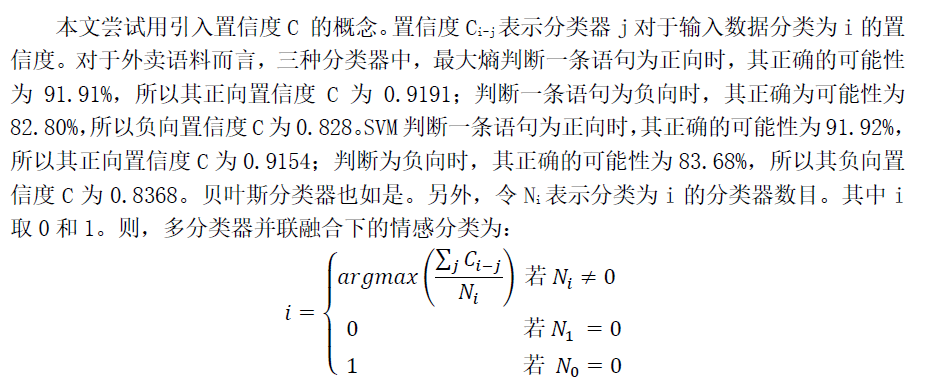
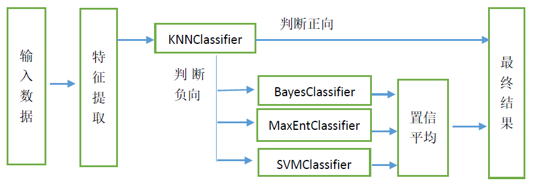

# 介绍
## 1、初衷
探究基于多分类器组合的情感极性分析。

## 2、结果
原本发现实验结果有效，后来，发现代码有一部分写错，实验结果其实不能达到，所以该实验是失败。将该实验提交到github，也算一种思路的清理。

## 3、文件
该repository下的内容包含[SentimentPolarityAnalysis](https://github.com/chaoming0625/SentimentPolarityAnalysis)repository下的内容，还包含四个MultipleClassifiers，以及基于selenium的动态爬取js网页的爬虫代码。是[SentimentPolarityAnalysis](https://github.com/chaoming0625/SentimentPolarityAnalysis)repository的扩充与延伸。

# 实验内容
## 1、多分类器并联组合：投票决策

## 2、多分类器并联组合：置信平均

## 3、多分类器串并联组合：投票决策

## 4、多分类器串并联组合：置信平均

